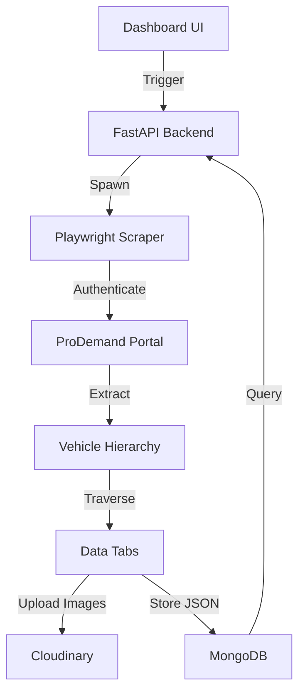

# 🚗 ProDemand Data Scraper & Dashboard

[](https://www.python.org/)
[](https://playwright.dev/)
[](https://fastapi.tiangolo.com/)
[](https://www.mongodb.com/)

A professional-grade, high-performance automated data extraction suite for **ProDemand.com**. This system traverses complex vehicle hierarchies to extract technical service data, specifications, and complete service manuals, all viewable through an intuitive real-time dashboard.

---

## ✨ Key Features

### 🔍 Precision Extraction
- **Hierarchical Traversal**: Automatically drills down through `Year` ➔ `Make` ➔ `Model` ➔ `Engine` ➔ `Submodel` ➔ `Options`.
- **Comprehensive Data**: Captures all 11 technical tabs including TSBs, Fluid Specs, DTCs, Wiring Diagrams, and Resets.
- **Service Manual specialist**: Deep-scrapes the full Service Manual tree, preserving article structures and media.

### 🛡️ Stealth & Stability
- **Anti-Bot Tech**: Integrated `playwright-stealth` to evade detection and ensure reliable long-running sessions.
- **Auto-Session Management**: Automatically detects and terminates existing Mitchell1 sessions to prevent account lockouts.
- **Robust Recovery**: Sophisticated error handling with automatic retries and debug screenshot capture on failure.

### 📊 Modern Management
- **Interactive Dashboard**: Built with FastAPI and Jinja2, allowing users to trigger scrapes and browse data via a web UI.
- **Cloud-Ready Assets**: Seamless integration with **Cloudinary** for scalable hosting of extracted vehicle diagrams and images.
- **Schema-Agnostic Storage**: Leverages MongoDB to store complex, nested technical data without rigid relational constraints.

---

## 🏗️ Technical Architecture



---

## 🛠️ Setup & Installation

### 1. Prerequisites
- Python 3.9+
- MongoDB instance (Local or Atlas)
- Cloudinary Account (for image hosting)

### 2. Environment Setup
```bash
# Clone the repository and enter the directory
cd scraper

# Create and activate virtual environment
python -m venv venv
.\venv\Scripts\activate

# Install core dependencies
pip install -r requirements.txt

# Install Playwright browser engines
playwright install chromium
```

### 3. Configuration (`.env`)
Ensure your `.env` file contains the following:
```env
PRODEMAND_USERNAME=your_username
PRODEMAND_PASSWORD=your_password

CLOUDINARY_CLOUD_NAME=your_cloud_name
CLOUDINARY_API_KEY=your_api_key
CLOUDINARY_API_SECRET=your_api_secret

MONGODB_URI=mongodb://localhost:27017/
DATABASE_NAME=prodemand_db
```

---

## 🚀 Usage Guide

### Option A: The Interactive Dashboard (Recommended)
Launch the web interface to manage extractions and explore the database.
```bash
python dashboard/app.py
```
📍 **URL**: `http://localhost:8081`

### Option B: Command Line Interface (Advanced)
Use the CLI for targeted or batch operations.

| Command | Description |
| :--- | :--- |
| `python main.py` | Run sequential scrape for all years/makes. |
| `python main.py --year 2024` | Scrape all vehicles for a specific year. |
| `python main.py --year 2024 --force` | Re-scrape and overwrite existing records. |

---

## 📂 Project Structure

- **`dashboard/`**: FastAPI application, HTML templates, and API routes.
- **`vehicle_hierarchy/`**: Core scraping logic and vehicle selection automation.
- **`output/`**: Local cache of extracted JSON and media (before DB/Cloud upload).
- **`debug/`**: Automated screenshots captured during failed scraper runs.
- **`main.py`**: Entry point for CLI-based extraction.

---

## ⚠️ Troubleshooting & Tips

- **Session Blocking**: If you see "Session Active" errors, the scraper will attempt to click "Terminate Other Session". If it fails, wait 5 minutes and retry.
- **Memory Usage**: For massive batch scrapes, ensure your system has at least 8GB RAM as Playwright can be resource-intensive.
- **Verification**: Use `vehicle_hierarchy/db_verify.py` to check the integrity of your MongoDB collections.

---

> [!IMPORTANT]
> This tool is for educational and research purposes. Please ensure you comply with the Terms of Service of any website you interact with.

